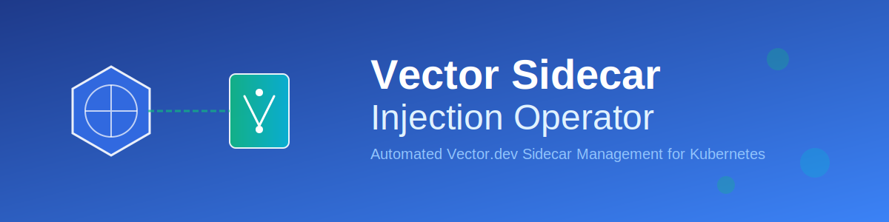

<div align="center">



# Vector Sidecar Injection Operator

[](LICENSE)
[](go.mod)
[](https://kubernetes.io)
[](CONTRIBUTING.md)

A production-ready Kubernetes operator that automatically injects [Vector.dev](https://vector.dev) sidecar containers into workloads based on label selectors, enabling per-workload observability configuration at scale.

[Features](#key-features) •
[Quick Start](#quick-start) •
[Documentation](#documentation) •
[Examples](#examples) •
[Contributing](#contributing)

</div>

---

## Overview

The Vector Sidecar Injection Operator watches for `VectorSidecar` Custom Resources and automatically injects Vector sidecar containers into matching Kubernetes Deployments. This enables centralized management of observability infrastructure while maintaining per-workload configuration flexibility.

### Key Features

- **Label-Based Workload Selection**: Target specific Deployments using Kubernetes label selectors
- **Idempotent Injection**: Smart hash-based tracking prevents unnecessary rollouts
- **ConfigMap-Based Configuration**: External configuration management with automatic reload support
- **Resource Management**: Full support for CPU/memory requests and limits
- **Status Reporting**: Comprehensive status conditions and deployment tracking
- **Cleanup on Deletion**: Automatic sidecar removal when VectorSidecar CR is deleted or disabled
- **Namespace-Scoped**: Operates within namespace boundaries for security

## Architecture

The operator implements a reconciliation loop that:

1. Watches `VectorSidecar` CRs for injection rules
2. Discovers Deployments matching the label selector
3. Calculates injection configuration hash
4. Injects Vector sidecar if configuration changed
5. Reports status with matched/injected deployment counts

### Idempotent Injection

The operator uses SHA256 hashing of the injection configuration to ensure deployments are only updated when the sidecar configuration actually changes. This prevents unnecessary pod restarts and maintains cluster stability.

## Installation

### Prerequisites

- Kubernetes cluster (v1.20+)
- kubectl configured to access your cluster
- Cluster admin permissions for CRD installation

### Quick Start

1. **Install the CRDs**:

```bash
make install
```

2. **Run the operator** (for development):

```bash
make run
```

Or deploy to the cluster:

```bash
make deploy IMG=<your-registry>/vector-sidecar-operator:latest
```

### Using Pre-built Flags

For development environments where port conflicts may occur:

```bash
make run ARGS="--disable-metrics --disable-health-probes"
```

## Usage

### 1. Create a Vector Configuration ConfigMap

```yaml
apiVersion: v1
kind: ConfigMap
metadata:
  name: vector-config
  namespace: default
data:
  vector.yaml: |
    sources:
      kubernetes_logs:
        type: kubernetes_logs

    sinks:
      stdout:
        type: console
        inputs:
          - kubernetes_logs
        encoding:
          codec: json
```

### 2. Create a VectorSidecar CR

```yaml
apiVersion: observability.amitde789696.io/v1alpha1
kind: VectorSidecar
metadata:
  name: vector-sidecar-example
  namespace: default
spec:
  enabled: true
  selector:
    matchLabels:
      observability: vector
  sidecar:
    name: vector
    image: timberio/vector:0.35.0
    config:
      configMapRef:
        name: vector-config
        key: vector.yaml
    volumeMounts:
      - name: varlog
        mountPath: /var/log
    resources:
      requests:
        cpu: 100m
        memory: 128Mi
      limits:
        cpu: 500m
        memory: 256Mi
  volumes:
    - name: varlog
      hostPath:
        path: /var/log
```

### 3. Label Your Deployments

Add the matching label to your Deployment:

```yaml
apiVersion: apps/v1
kind: Deployment
metadata:
  name: my-app
  labels:
    observability: vector  # This matches the selector
spec:
  template:
    spec:
      containers:
      - name: app
        image: nginx:latest
```

### 4. Verify Injection

Check the VectorSidecar status:

```bash
kubectl get vectorsidecar -o wide
```

Expected output:
```
NAME                      ENABLED   MATCHED   INJECTED   READY   AGE
vector-sidecar-example    true      1         1          True    2m
```

Verify the sidecar was injected:

```bash
kubectl get deployment my-app -o jsonpath='{.spec.template.spec.containers[*].name}'
```

Should show: `app vector`

## Configuration Reference

### VectorSidecarSpec

| Field | Type | Required | Description |
|-------|------|----------|-------------|
| `enabled` | bool | Yes | Controls whether injection is active |
| `selector` | LabelSelector | Yes | Label selector for matching Deployments |
| `sidecar` | SidecarConfig | Yes | Vector sidecar container configuration |
| `initContainers` | []Container | No | Optional init containers to inject |
| `volumes` | []Volume | No | Additional volumes to mount |

### SidecarConfig

| Field | Type | Required | Description |
|-------|------|----------|-------------|
| `name` | string | No | Container name (default: "vector") |
| `image` | string | Yes | Vector container image |
| `imagePullPolicy` | PullPolicy | No | Image pull policy (default: IfNotPresent) |
| `config` | VectorConfig | Yes | Vector configuration source |
| `volumeMounts` | []VolumeMount | No | Volume mounts for the container |
| `resources` | ResourceRequirements | No | CPU/memory requests and limits |
| `env` | []EnvVar | No | Environment variables |
| `args` | []string | No | Additional container arguments |

### VectorConfig

| Field | Type | Required | Description |
|-------|------|----------|-------------|
| `configMapRef` | ConfigMapRef | No* | Reference to ConfigMap containing config |
| `inline` | string | No* | Inline Vector configuration (YAML/TOML) |

*One of `configMapRef` or `inline` must be specified.

## Status Conditions

The operator reports status through standard Kubernetes conditions:

- **Ready**: Sidecar injection is operating normally
- **ConfigValid**: Vector configuration passed validation
- **Error**: An error occurred during reconciliation

Check status:

```bash
kubectl describe vectorsidecar vector-sidecar-example
```

## Advanced Usage

### Disable Injection Temporarily

Set `enabled: false` to remove sidecars from all matched deployments:

```bash
kubectl patch vectorsidecar vector-sidecar-example -p '{"spec":{"enabled":false}}' --type=merge
```

### Multiple VectorSidecar Configurations

You can create multiple VectorSidecar CRs with different selectors:

```yaml
# Production workloads
apiVersion: observability.amitde789696.io/v1alpha1
kind: VectorSidecar
metadata:
  name: vector-production
spec:
  selector:
    matchLabels:
      env: production
  sidecar:
    image: timberio/vector:0.35.0
    config:
      configMapRef:
        name: vector-config-prod
---
# Development workloads
apiVersion: observability.amitde789696.io/v1alpha1
kind: VectorSidecar
metadata:
  name: vector-development
spec:
  selector:
    matchLabels:
      env: development
  sidecar:
    image: timberio/vector:0.35.0
    config:
      configMapRef:
        name: vector-config-dev
```

### Custom Volume Mounts

Add custom volumes for log collection:

```yaml
spec:
  sidecar:
    volumeMounts:
      - name: app-logs
        mountPath: /app/logs
      - name: varlog
        mountPath: /var/log
  volumes:
    - name: app-logs
      emptyDir: {}
    - name: varlog
      hostPath:
        path: /var/log
```

## Examples

Complete examples are available in the `examples/` directory:

- `examples/vector-config.yaml` - Sample Vector configuration
- `examples/test-deployment.yaml` - Test application deployment
- `examples/example-cr.yaml` - Complete VectorSidecar CR example

Apply all examples:

```bash
kubectl apply -f examples/
```

## Development

### Running Tests

Run unit tests:

```bash
make test
```

### Building the Operator

```bash
make build
```

### Generating Manifests

After modifying API types:

```bash
make generate  # Generate deepcopy code
make manifests # Generate CRDs and RBAC
```

### Local Development

Run the operator locally against your kubeconfig cluster:

```bash
# Install CRDs
make install

# Run operator (disabling metrics/health probes to avoid port conflicts)
make run ARGS="--disable-metrics --disable-health-probes"
```

## Troubleshooting

### Sidecar Not Injected

1. Check VectorSidecar status:
   ```bash
   kubectl describe vectorsidecar <name>
   ```

2. Verify labels match:
   ```bash
   kubectl get deployment <name> --show-labels
   ```

3. Check operator logs:
   ```bash
   kubectl logs -n vector-sidecar-operator-system deployment/vector-sidecar-operator-controller-manager
   ```

### ConfigMap Not Found

The operator validates ConfigMap existence. Ensure the ConfigMap exists in the same namespace:

```bash
kubectl get configmap vector-config -n <namespace>
```

### Unwanted Rollouts

The operator uses hash-based change detection. Rollouts only occur when:
- Sidecar image changes
- Configuration changes
- Resource requirements change
- Volume mounts change

## Architecture Details

### Annotations

The operator adds these annotations to managed Deployments:

- `vectorsidecar.observability.amitde789696.io/injected`: Set to "true" when injected
- `vectorsidecar.observability.amitde789696.io/injected-hash`: Hash of injection config
- `vectorsidecar.observability.amitde789696.io/sidecar-name`: Name of managing VectorSidecar CR
- `vectorsidecar.observability.amitde789696.io/configmap-version`: ConfigMap resourceVersion

### Finalizers

The operator uses finalizers to ensure proper cleanup:

- `vectorsidecar.observability.amitde789696.io/finalizer`: Ensures sidecars are removed before CR deletion

## Documentation

📚 **Comprehensive guides available in the [`docs/`](docs/) directory:**

- [**Getting Started Guide**](docs/getting-started.md) - Step-by-step installation and first deployment
- [**Architecture Guide**](docs/architecture.md) - Deep dive into operator design and patterns
- [**Configuration Reference**](docs/configuration.md) - Complete API reference and examples
- [**Best Practices**](docs/best-practices.md) - Production deployment recommendations
- [**Troubleshooting Guide**](docs/troubleshooting.md) - Common issues and solutions
- [**Development Guide**](docs/development.md) - Contributing and local development setup

## Contributing

Contributions are welcome! We appreciate all contributions, from bug reports to feature implementations.

**Please read our [CONTRIBUTING.md](CONTRIBUTING.md) guide before submitting pull requests.**

Quick contribution steps:

1. Fork the repository
2. Create a feature branch (`git checkout -b feature/amazing-feature`)
3. Make your changes with clear commit messages
4. Add tests for new functionality
5. Ensure all tests pass (`make test`)
6. Submit a pull request

### Code of Conduct

This project follows the [CNCF Code of Conduct](https://github.com/cncf/foundation/blob/master/code-of-conduct.md).

### Code Style

- Follow standard Go formatting (`go fmt`, `go vet`)
- Add comprehensive comments for complex logic
- Include unit tests for new features
- Keep functions focused and testable

## License

Copyright 2026.

Licensed under the Apache License, Version 2.0 (the "License");
you may not use this file except in compliance with the License.
You may obtain a copy of the License at

    http://www.apache.org/licenses/LICENSE-2.0

Unless required by applicable law or agreed to in writing, software
distributed under the License is distributed on an "AS IS" BASIS,
WITHOUT WARRANTIES OR CONDITIONS OF ANY KIND, either express or implied.
See the License for the specific language governing permissions and
limitations under the License.
